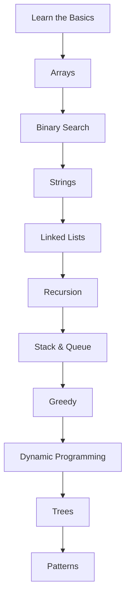

Perfect! Here's an enhanced version of your README with professional badges and a visual roadmap to make your repository stand out:

---

# 🚀 Striver DSA Sheet – Solved by Chandrasish


Welcome to my curated repository of solutions to the [Striver DSA Sheet](https://takeuforward.org/interviews/strivers-sde-sheet-top-coding-interview-problems/), a structured roadmap for mastering Data Structures and Algorithms. This archive is crafted for learners, interviewees, and educators alike.

---

## 🧭 Visual Roadmap



---

## 🗂️ Folder Structure

```
├── 01_Learn The Basics/
├── 03_ARRAYS/
├── 04_BS_1D,2DArrays_SearchSpace/
│   └── 01_BS_ON1D/
├── 05_Strings/
├── 06_LinkedList/
├── 07_Recursion/
├── 09_StackandQueues/
├── DP/
├── GREEDY/
├── PATTERNS/
├── TREE/
└── README.md
```

---

## 🧩 Topics Covered

| Category            | Description |
|---------------------|-------------|
| Arrays              | Traversal, sorting, prefix/suffix logic |
| Strings             | Palindromes, anagrams, pattern matching |
| Linked Lists        | Reversal, cycle detection, merge operations |
| Recursion           | Backtracking, base-case analysis |
| Stack & Queue       | Monotonic stack, sliding window |
| Binary Search       | Search space reduction on 1D/2D arrays |
| Dynamic Programming | Memoization, tabulation, optimization |
| Greedy              | Interval scheduling, coin problems |
| Trees               | Traversals, BST operations, recursion |
| Patterns            | Sliding window, two pointers, hashing |

---

## ⚙️ How to Use

```bash
# Clone the repository
git clone https://github.com/Chandrasish-Bhattacharya/Striver-DSA.git

# Navigate into the project
cd Striver-DSA
```

- 🔍 Browse topic-wise folders for code and explanations  
- 🧪 Run solutions using your preferred language compiler (Java, Python, C++)  
- 📊 Each solution includes:
  - ✅ Problem link or description  
  - ✅ Approach breakdown  
  - ✅ Code implementation  
  - ✅ Time & Space complexity analysis  

---

## 🛠 Tools Used

- **VS Code** – for writing and debugging  
- **Git & GitHub** – for version control and collaboration  
- **Java & Python** – primary languages used  

---

## 🤝 Contributions

This is a personal learning archive, but:
- 💡 Suggestions are welcome  
- 🛠 Found a better approach? Feel free to open an Issue or Pull Request  

---

## ⭐ Support

If this helps you:
- 🌟 Star the repo to show appreciation  
- 🔗 Share with peers preparing for interviews or learning DSA  
- 📺 Follow [DevMind Hub](https://www.youtube.com/@devmindhub) for visual walkthroughs and quiz sets  

---

✨ _Happy Coding and Keep Building!_ ✨
