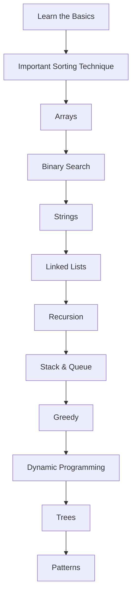

# 📘 Striver DSA Solutions — Chandrasish Bhattacharya

A structured, topic-wise archive of solutions to the Striver DSA Sheet. Built for learners, interviewees, and educators with clean implementations, clear reasoning, and consistent organization.

---

## 🚀 Quick Start

```bash
# Clone the repository
git clone https://github.com/Chandrasish-Bhattacharya/Striver-DSA.git
cd Striver-DSA

# Browse topic-wise folders and run solutions using Java or Python
```

Each solution includes:
- Problem link or description
- Approach breakdown
- Code implementation
- Time & Space complexity analysis

---

## 🧭 Visual Roadmap



---

## 📂 Folder Index

Folder | Coverage
---|---
01_Learn The Basics | Starter problems, fundamentals
03_ARRAYS | Traversal, sorting, prefix/suffix logic
04_BS_1D,2DArrays_SearchSpace/01_BS_ON1D | Binary search patterns
05_Strings/Basics | String operations, algorithms
06_LinkedList | Reversal, cycle detection, merging
07_Recursion | Base cases, backtracking
09_StackandQueues | Monotonic stacks, sliding window
10_SlidingWindow&TwoPointerCombinedProblems/MediumProblems | Combined patterns
15_Graphs_ConceptsAndProblems | Graph traversals, classical problems
DP | Dynamic programming
GREEDY | Greedy strategies and problems
TREE | Binary trees, BST operations
Some Infosys Question | Practice problems

---

## 📝 Problem Tracker

A lightweight checklist mapped to Striver’s sheet. Tick off items as you solve them.

Arrays
- [ ] Kadane’s Algorithm (Maximum Subarray Sum)
- [ ] Two Sum
- [ ] Merge Intervals
- [ ] Rotate Matrix

Strings
- [ ] Longest Palindromic Substring
- [ ] Anagram Groups
- [ ] String Matching (KMP)

Binary Search
- [ ] First/Last Occurrence
- [ ] Peak Element
- [ ] Search in Rotated Array

Linked List
- [ ] Reverse Linked List
- [ ] Detect Cycle
- [ ] Merge Two Sorted Lists

Recursion
- [ ] Subsets
- [ ] Permutations
- [ ] N-Queens

Stack & Queue
- [ ] Next Greater Element
- [ ] Sliding Window Maximum
- [ ] Min Stack

Greedy
- [ ] Activity Selection
- [ ] Minimum Coins
- [ ] Jump Game

DP
- [ ] Longest Increasing Subsequence
- [ ] 0/1 Knapsack
- [ ] Edit Distance

Trees
- [ ] Inorder Traversal
- [ ] Level Order Traversal
- [ ] Lowest Common Ancestor

---

## 🛠 Conventions

- Structure: Topic-first, then problem-specific files.
- Documentation: Markdown notes, diagrams (Mermaid) for visualization.
- Coding practices: Readable, commented, complexity-aware.
- Languages: Java & Python (primary). Some C++ may be present.

---

## 🤝 Contributing

This is a personal learning archive, but contributions are welcome.

- Found a better approach? Open an Issue or Pull Request.
- Keep code clean and well-commented.
- Follow folder and naming conventions when adding solutions.

---

## ⭐ Support

If this repo helps you:
- Star the repo to show appreciation
- Share with peers preparing for interviews or learning DSA

---

## 📜 License

This project is licensed under the MIT License — feel free to use and adapt with attribution.
